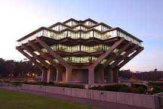

# Welcome to Eric's CSE110 Page!

> Whatever you are, be a good one.
> -Abraham Lincoln

## About me

Hi! My name is **Eric Jin** and I am a ~~first~~ second year CSE Student at UCSD.



Please note: ***This is my school account!*** **Visit the link _below_** to see my other Github Account.

[Click here](https://www.youtube.com/watch?v=dQw4w9WgXcQ) to go to my other account.

JK, [here's](https://github.com/twojineric) the actual link to my other account.

## Fun things

After years of planning and design, I have come up with the most efficient sorting algorithm possible. Take a look.

```
	function sortsortsort(list)
	{
		while(!list.isSorted())
		{
			list.shuffle();
		}
		return list;
	}
```

Here are the best colleges in UCSD, ranked.
1. Revelle
2. Everything else

Here is a floating shopping list (not a ghost)
- Milk
- Eggs
- Cheese

To-Do List
- [x] Open the refrigerator
- [x] Take out the giraffe
- [ ] Put in the elephant
- [ ] Close the door
- [ ] ???
- [ ] Profit

Thanks for visiting! You can click [here](#welcome-to-erics-cse110-page) for a free ride back to the top. : )
